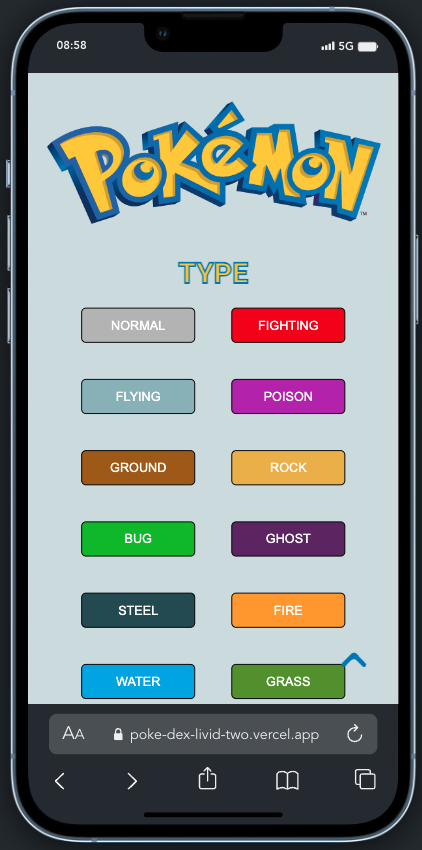
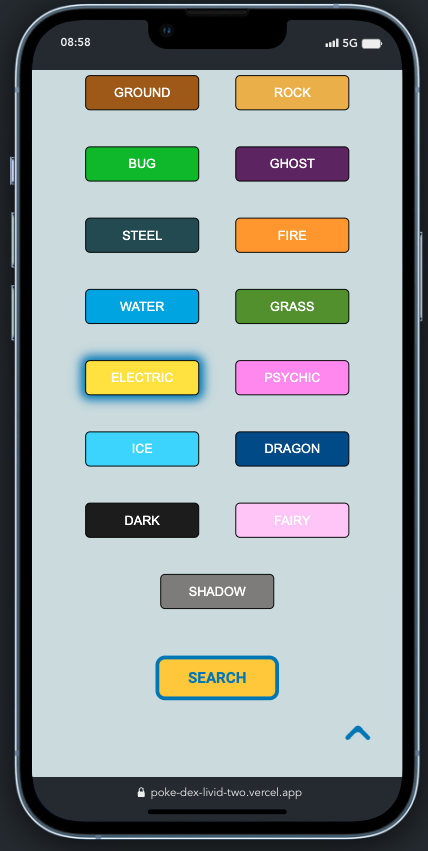
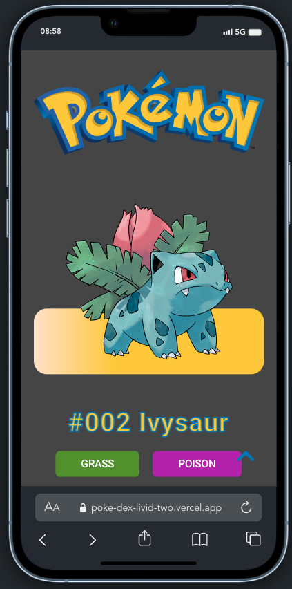

<h1 align="center"><samp>Pokemon App</samp> </h1>

<h3><samp>Contributors:</samp></h3>
<ul>
<a href="https://github.com/MiaMarmeladenbrot"><li><samp>Mia Mecklenburg</samp></li></a>
<a href="https://github.com/xoFrey"><li><samp>Izel Acar</samp></li></a>
<a href="https://github.com/Hkndevit"><li><samp>Hakan Devit</samp></li></a>

</ul>

<h3><samp>Build with:</samp></h3>
<ul>
<li><samp>ReactJS Vite</samp></li>
<li><samp>JavaScript</samp></li>
<li><samp>HTML5</samp></li>
<li><samp>CSS</samp></li>
</ul>

<h3><samp>Features:</samp></h3>
<ul>
<li><samp>Made with <a href="https://pokeapi.co/">Poke API</a></samp></li>
<li><samp>Showing all Pokemon ordered by generations</samp></li>
<li><samp>Search Pokemon by names</samp></li>
<li><samp>Filter Pokemon by types</samp></li>
<li><samp>Dynamic Detail Page for each Pokemon</samp></li>
<li><samp>Darkmode</samp></li>

</ul>

<h2><samp>Live site</samp></h2>
<li><samp><a href="https://poke-dex-eta-eight.vercel.app/">Live Page</a></samp></li>

<h2><samp>Screenshots</samp></h2>
<!-- Home -->

<!-- Filter -->

<!-- Details -->

